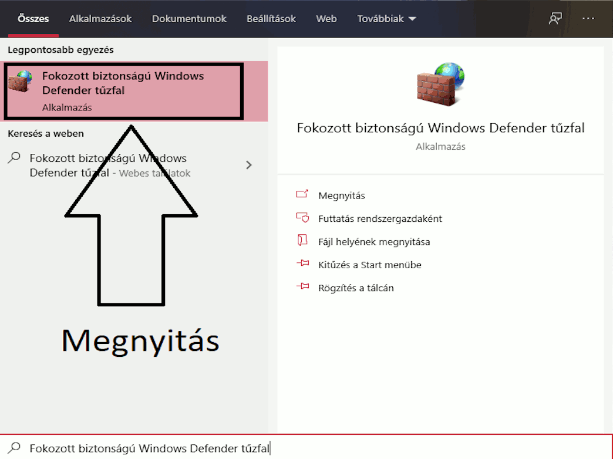

# **PCTool - Windows kliens**
> Egy olyan számítógépes eszköz mely sok olyan funkciót is tartalmaz, amelyet telefonon keresztül irányíthatunk az ehhez készült alkalmazással *TODO: LINK*. 

## Telepítés
************

Letöltöd a **PCTool.exe**-t az **installer** branchről. *(TODO: Vagy erről a linkről)* A telepítő utasításaid követve felrakod.

### A port engedélyezése
> Ahhoz, hogy a program tudjon kommunikálni a telefonos alkalmazással szükséges engedélyezni a *7171* portot a Windows tűzfalban. *Vagy azt kikapcsolni, bár ezt nem javaslom.*
Ezt a program a telepítéskor megcsinálja. Amennyiben mégse az itt leírtak szerint tudod engedélyezni / ellenőrizni.

1. Windows keresőben megkeresed a **Fokozott biztonságú Windows Defender tűzfal**
2. Baloldali menü oszlopban kiválasztod a **Bejövő szabályok** pontot
3. Jobb oldali menü oszlopban kiválasztod a **Új szabály...** pontot
4. A varázslóban az alábbiak szerint jársz el:
    1. Szabály típusa: **Port**
    2. **TCP** protokoll legyen kipipálva, **Adott helyi portok:** legyen kipipálva majd ott add meg az alábbi portot: **7171**
    3. Művelet: **Engedélyezze a kapcsolatot**
    4. Profil opcionálisan állítható
    5. Név: Amit Te szeretnél, átlathatóság kedvéért: PCTool *(Amennyiben a telepítő sikeresen hozzá adta a portot a listához ezen a néven találod meg!)*

> Amennyiben használsz más fajta tűzfalat is elképzelhető, hogy ott is át kell engedni a portot. Akár még a programot is !

## Funkciók
************
> A program fő funkciója, hogy a számítógépedet bizonyos műveleteket tudj időzítve végre hajtani. Egyszerre több művelet is elindítható.

### Végrehajtható műveletek

1. Kikapcsolás
2. Újraindítás
3. Alvás
4. Lezárás
5. Hibernálás *(Ha a gépeden engedélyezett!)*
6. Kijelentkezés
7. Saját művelet *(A program saját művelet szerkesztőjével készítve)*
    * Adott futtatható fájl futtatása *(Tallózással választva)*
    * Adott folyamat leállítása *(Feladatkezelőből választott)*
    * Rendszer hang állítása
    * Egy adott alkalmazás hangjának az állítása 

A program képes értesítést küldeni (TODO: W10 only ?) a következő műveletről, amennyiben a Fájl - Beállítások - **Értesítés küldése** funkció be van pipálva.
1 perccel és 5 perccel a művelet bekövetkezte előtt küld arról egy értesítőt, amennyiben a művelet hosszabb 1 vagy 5 percnél.

### Távirányíthatóság

Ahhoz, hogy a program távirányítható legyen az alábbiak szükségesek:

* **Rendszergazdaként futtatni a programot** *(Jobb klikk - futtatás rendszergazdaként, vagy beállítani, hogy mindig rendszergazdaként futtassuk: Jobb klikk - Tulajdonságok - Kompatibilitás - Program futtatása rendszergazdaként opció kipipálása majd alkalmazása)*
* **Ugyanazon a hálózathoz** *(internet nem szükséges)* **legyen csatlakoztatva a két eszköz**
* Fájl - Beállítások - Távirányító - **Távirányíthatóság funkció ki legyen pipálva** a kliensben

    > Amint engedélyezzük a távirányíthatóságot két helyzetet különböztetünk meg:
    > 1. Amennyiben 1 hálózatra vagyunk csak csatlakozva akkor a menüsor jobb oldalán megjelenik az IP cím amelyen keresztül leszünk elérhetőek.
    > 2. Amennyiben több hálózatra vagyunk csatlakozva a gépünkkel megjelenik egy ablak ahol kiválaszthatjuk azt a címet melyen szeretnénk elérhetővé tenni a gépünket. 

#### Távirányíthatóság funkciói 
TODO: API hívások
* Adott végrehajtható műveletek listázása
* Végrehajtható művelet indítása
* Jelenleg futó művelet leállítása
* Jelenleg futó műveletek listázása
* A jelenleg futó folyamatok lekérése *(feladatkezelő)*
    * Adott folyamat leállítása (realtime módon - nem időzett)
        >Fájl - Beállítások - Távirányító - **Feladdatkezelő küldése** menüpontban állítható.
* A rendszer hang realtime módon való irányítása
    >Fájl - Beállítások - Távirányító - **Rendszerhang küldése** menüpontban állítható.

### Saját művelet készítése
A programban saját műveleteket is definiálhatunk. Az ehhez szükséges gombot a *Futtatható műveletek* lista legalján találjuk meg egy + jel formájában.
Felugró ablakban adunk neki egy nevet, majd egy típust az alábbiak közül:

#### Adott fájl futtatása
Tallózással kiválasztunk egy fájlt, melyet a program megnyit amennyiben a fájlhoz van társítva kezelő program.

#### Adott folyamat leállítása
Kiválasztunk a listából egy folyamatot amelyiket le szeretnénk állítani. Ezek a folyamatok megegyeznek a feladatkezelő folyamatival.
>Fontos, hogy ilyenkor a program a folyamat nevét tárolja, nem a folyamatazonosítóját, ugyanis az minden indításkor más számot kap.

#### Rendszer hang állítása
Egy sliderrel megadhatjuk, hogy mennyire állítsa majd a rendszer hangerejét.

#### Egy adott alkalmazás hangjának az állítása 
Egy sliderrel megadjuk, hogy mennyire állítsa majd az adott programnak a hangját.
A programot pedig a listábol választhatjuk ki, hasonló elv alapján működve mint az *Adott folyamat leállítása* funkciónál volt leírva.

## Készítők
************
Dancs Bertalan 

## Licensz
************

TODO: Milyen licenszek érvényesek ??