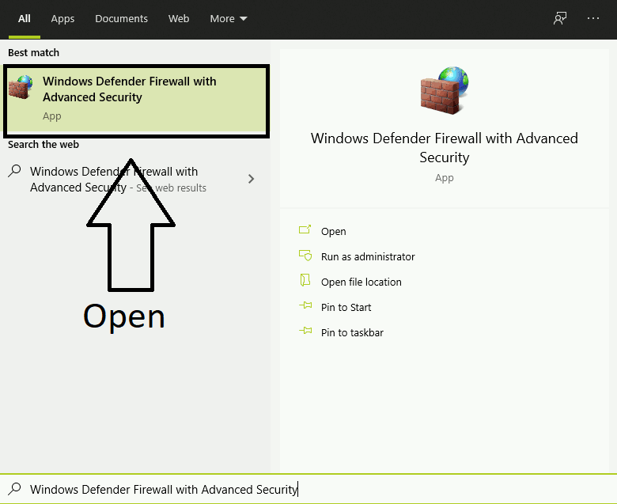

# **PCTool - Windows client**
************
> This is a program which you can automate some tasks on your computer. These tasks has two type: built-in(e.g.:shutdown, reboot, sleep etc.) [custom](#custom-tasks)(run file. kill a process etc). Your custom tasks can be saved.
We can remote this app with the [Remote API](#remote-api).

## PCTooL 1.0 - *(Under development)*
************
> PCTooL 1.0 - will be avilable on **1.0 branch** *(only source code)* - features 
✔️ - Function completed 
❌ - Function not completed

- Notification system supported *(>Windows 8)*
- Multi language *(initially available english and hungarian)*
- System based settings for program
 - Run as Administrator
 - Hibernate on/off *admin rights required*
    > For this feature used this [tenforums article](https://www.tenforums.com/tutorials/2859-enable-disable-hibernate-windows-10-a.html) "OPTION THREE"
 - Run with Windows
   - Run with Windows minimized
- Program based settings
 - Remote
    > When this function turned on then program can receive [Remote API](#remote-api) requests, so this remotely controllable. For remote this app I create a Android client.
 - Default sound device sending
    > When this turned on then Windows volume can change with remote in real time. *(Depends on your network speed!)*
 - Process Manager sending
    > When this turned on then can see,kill currently running process and their some data.
 - Exit minimize to tray
    > When you click on "red cross" at right top minimize app to tray instead of close. You can close this app from "File" menu option.
- Automatic bugreport
    > The program can send automatic error reports to the developer(s) if you enable it. To do this, program use [Sentry API](sentry.io/).
- Custom tasks *(Available timer function)*
 - Default sound device volume change
 - Program volume change
 - Run a file
 - Kill a process
    > One selected process, program kill. We can select process from "Process selector" view.
- Run a specific task immediately *(custom/built-in)*
- Scheduled run of a specific task *(custom/built-in)*

## Remote API *(Under planning)*
************
> Remote API requests and their responses. **Currently under planning!**

## Installation
************
Download PCTooL_X.X-installer.exe from **installers** branch and follow installer instructions.

The [Remote API](#remote-api) requires the **65400 TCP** port to be enabled in Windows Firewall. When the program installing then automatically added this port to firewall, if not you can do it with these instructions:

1. Search in Start menu **Windows Defender Firewall with Advanced Security**
2. Select **Inbound rules** at the left side menu column
3. Select **New Rule...** at the right side menu column
4. In New Inbound Rule Wizard follow these instructions:
    1. Rule Type: **Port**
    2. Select **TCP** port, select **Specific local ports:** add this **65400**
    port to text field
    3. Action: **Allow the connection**
    4. You can change profile optionally
    5. Name: What you want ;) For the sake of transparency: PCTool *(If the installer has successfully added the port to the list, you will find it under this name!)*

This GIF maybe helps for you, if these instructions is not enough:

*Not recommended solution is [Disable Windows Firewall](https://support.microsoft.com/en-us/help/4028544/windows-10-turn-microsoft-defender-firewall-on-or-off)*

**Importat** if you use another firewall maybe need allow this port in firewall.
*I tested with Comodo Internet Security and with this not need allow this port.*

## Resources for development
************

### Programs
- [Visual Studio Community 2019](https://visualstudio.microsoft.com/vs/)
- [Visual Studio Code](https://code.visualstudio.com/)
- [Gimp](https://www.gimp.org/)
- [Sourcetree](https://www.sourcetreeapp.com/)
- [Meld](https://meldmerge.org/)
- [Trello app](https://www.microsoft.com/store/productId/9NBLGGH4XXVW)

### Articles, guides, repos
- [Localization](https://stackoverflow.com/questions/50292087/dynamic-localized-wpf-application-with-resource-files/50292715)
- [Support Windows 10 notification system](https://github.com/microsoft/Windows-classic-samples/tree/master/Samples/DesktopToasts/CS)
- [Run as Admin *(option eleven)*](https://www.tenforums.com/tutorials/3436-run-administrator-windows-10-a.html)
- [Hibernate on/off *(option three)*](https://www.tenforums.com/tutorials/2859-enable-disable-hibernate-windows-10-a.html)
- [NotifyTask class](https://github.com/StephenCleary/Mvvm.Async/blob/master/src/Nito.Mvvm.Async/NotifyTask.cs)
    > If we want to do something when a Task is ready, we have thrown an error or closed it.

### Another services
- [Trello](https://trello.com)
- [Bitbucket](https://bitbucket.org)
- [Sentry](sentry.io/)

### Libs, nugets
- [Mahapps.Metro](https://mahapps.com/)
- [Test Generator NUnit](https://marketplace.visualstudio.com/items?itemName=NUnitDevelopers.TestGeneratorNUnitextension)
- [NUnit3](https://nunit.org/)
- [NUnit3TestAdapter](https://github.com/nunit/nunit3-vs-adapter)
- [NUnit.ConsoleRunner](https://www.nuget.org/packages/NUnit.ConsoleRunner/)
- [MahApps.Metro](https://mahapps.com/)
- [Moq](https://github.com/moq/moq4)
- [Newtonsoft.Json](https://www.newtonsoft.com/json)
- [Ninject](http://www.ninject.org/download.html)
- [NotifyIcon for WPF](http://www.hardcodet.net/wpf-notifyicon)
- [NLog](https://nlog-project.org/)
- [Sentry](https://www.nuget.org/packages/Sentry)
- [Sentry.NLog](https://www.nuget.org/packages/Sentry.NLog/)
- [OpenCover](https://www.nuget.org/packages/OpenCover/)
- [ReportGenerator](https://www.nuget.org/packages/ReportGenerator/)
- [TaskScheduler](https://www.nuget.org/packages/TaskScheduler)

## Developer
************
Dancs Bertalan 

## License
************
#TODO