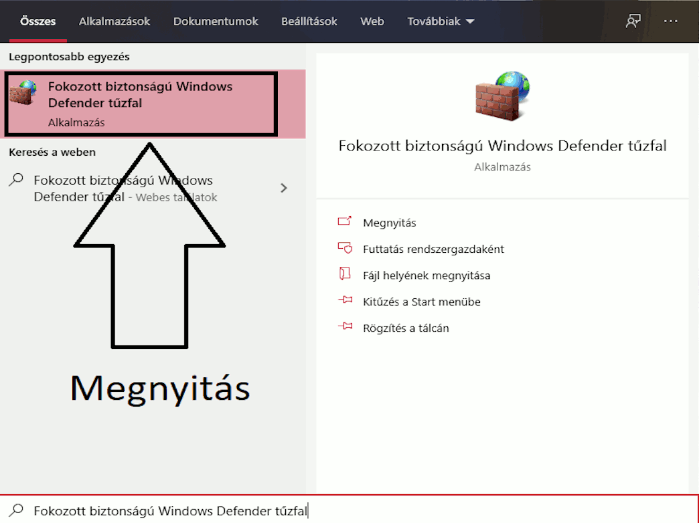

# **PCTool - Windows kliens**
************
> Egy olyan program mellyel a számítógépünkön automatizálhatunk különféle műveleteket(un.: taskokat). Ezek lehetnek beépítettek (kikapcsolás, újraindítás .... stb) vagy sajátok (adott fájl futtatása, hangerő állítás.... [Saját műveletek](#sajat-muveletek)), amelyek menthetőek későbbre.
Mindezt a [Távirányító API](#taviranyito-api)-val irányíthatjuk a telefonunkról is, az ehhez készült klienssel.

## PCTooL 1.0 - *(Jelenleg fejlesztés alatt)*
************
> A PCTooL 1.0-as verzió - amely a 1.0 branchen lesz elérhető *(csak a forrás kód)* - funkciói 
✔️ - Funkció kész 
❌ - Funkció nincs kész

- Az értesítési rendszer támogatása *(>Windows 8)*
- Többnyelvűség *(kezdetben magyar és angol)*
- Rendszer alapú beállítások kezelése a programhoz
 - Futtatás rendszergazdaként
 - Hibernálás ki/be kapcsolása *rendszergazdai jog szükséges az állításához*
    > A [tenforums cikkében](https://www.tenforums.com/tutorials/2859-enable-disable-hibernate-windows-10-a.html) található "OPTION THREE" megoldást használva.
 - Indítás a windowsszal
   - Indítás a windowsszal minimalizált állapotban
- Program alapú beálítások
 - Távirányító
    > Amikor ez be van kapcsolva akkor a program képes fogadni a [Távirányító API](#taviranyito-api) kéréseit, ezzel a program távirányíthatóvá válik. Ehhez készül egy Androidos kliens. 
 - Alapértelmezett hangeszköz küldése
    > Amikor ez be van kapcsolva akkor a Windows hangereje változtathatóvá válik a távirányítóval. valós időben. *(Hálózati sebességtől függően!)*
 - Feladatkezelő küldése
    > Amikor ez be van kapcsolva akkor az éppen futó folyamatokat, programokat és azoknak néhány adatát *(használt CPU, RAM erőforrás)* láthatod és állíthatod le a távirányítóval.
 - Kilépés a tálcára minimalizál
    > Az ablak kilépés gombja a kilépés helyett a tálca értesítési ikonjai közé minimalizálja a programot. Újra megnyitható a program innen, ha jobb klikkel rá kattintunk a program ikonjára majd "Megnyitás" menüt választjuk. Itt be is zárhatjuk a programot. Amennyiben a program előtérben van és be szeretnénk zárni a Fájl menüből megtehetjük.
- Automatikus hibajelentés
    > A program automatikus hiba jelentéseket küldhet a fejlesztő(k)nek, ha bekapcsolod ezt. Ehhez a [Sentry](www.sentry.io)-t használja.
- Saját műveletek *(Időzíthető)*
 - Alapértelmezett hangeszköz hangerejének állítása
 - Program hangerejének állítása
 - Egy adott fájl futtatása
 - Egy adott folyamat leállítása
    > Egy adott folyamat, program leállítása. Itt mi magunk választjuk ki, hogy melyik folyamatot szeretnénk bezárni, ezt egy "folyamat választó" nézetből tehetjük meg.
- Azonnali futtatása egy adott műveletnek *(egyéni/beépített)*
- Időzített futtatása egy adott műveletnek *(egyéni/beépített)*

## Távirányító API *(Tervezés alatt)*
************
> A távirányíthatóság kérései (requestek) és azoknak válaszai (responseok). **Jelenleg kidolgozás alatt áll !**

## Telepítés
************
Letöltöd az **installers** branchen található PCTooLX.X-installer.exe-t és a telepítő utasításait követve felrakod.

A [Távirányító API](#taviranyito-api) működéséhez szükséges a Windows Tűzfalban a **65400 TCP** port engedélyezése.  Ezt a program a telepítéskor megcsinálja. Amennyiben mégse az alábbi leírást követve tudod megtenni manuálisan:

1. Windows keresőben megkeresed a **Fokozott biztonságú Windows Defender tűzfalt**
2. Baloldali menü oszlopban kiválasztod a **Bejövő szabályok** pontot
3. Jobb oldali menü oszlopban kiválasztod a **Új szabály...** pontot
4. A varázslóban az alábbiak szerint jársz el:
    1. Szabály típusa: **Port**
    2. **TCP** protokoll legyen kipipálva, **Adott helyi portok:** legyen kipipálva majd ott add meg az alábbi portot: **65400**
    3. Művelet: **Engedélyezze a kapcsolatot**
    4. Profil opcionálisan állítható
    5. Név: Amit Te szeretnél, átlathatóság kedvéért: PCTool *(Amennyiben a telepítő sikeresen hozzá adta a portot a listához ezen a néven találod meg!)*

Egy GIF ami segít eligazodni, ha a fenti leírás nem elég:

*Nem javasolt megoldás lehet az is, ha a [Windows Tűzfalat kikapcsoljuk](https://support.microsoft.com/hu-hu/help/4028544/windows-10-turn-microsoft-defender-firewall-on-or-off)*

**Fontos** ha használsz egyéb tűzfalat is akkor elképzelhető, hogy ott is át kell engedni ezt a portot vagy a programot. *Comodo internet security alatt tesztelve, itt nem kell átengedni.*

## Fejlesztéshez használt források
************

### Programok
- [Visual Studio Community 2019](https://visualstudio.microsoft.com/vs/)
- [Visual Studio Code](https://code.visualstudio.com/)
- [Gimp](https://www.gimp.org/)
- [Sourcetree](https://www.sourcetreeapp.com/)
- [Meld](https://meldmerge.org/)
- [Trello app](https://www.microsoft.com/store/productId/9NBLGGH4XXVW)

### Cikkek, guideok, repók
- [Lokalizáció](https://stackoverflow.com/questions/50292087/dynamic-localized-wpf-application-with-resource-files/50292715)
- [W10 értesítési rendszer támogatása](https://github.com/microsoft/Windows-classic-samples/tree/master/Samples/DesktopToasts/CS)
- [Futtatás rendszergazdaként *(option eleven)*](https://www.tenforums.com/tutorials/3436-run-administrator-windows-10-a.html)
- [Hibernálás ki/bekapcsolása *(option three)*](https://www.tenforums.com/tutorials/2859-enable-disable-hibernate-windows-10-a.html)
- [NotifyTask class](https://github.com/StephenCleary/Mvvm.Async/blob/master/src/Nito.Mvvm.Async/NotifyTask.cs)
    > Ha valamit akarunk csinálni amikor egy Task kész van, hibát dobott vagy bezártuk.

### Egyéb szolgáltatások
- [Trello](https://trello.com)
- [Bitbucket](https://bitbucket.org)
- [Sentry](sentry.io/)

### Libek, nugetek
- [Mahapps.Metro](https://mahapps.com/)
- [Test Generator NUnit](https://marketplace.visualstudio.com/items?itemName=NUnitDevelopers.TestGeneratorNUnitextension)
- [NUnit3](https://nunit.org/)
- [NUnit3TestAdapter](https://github.com/nunit/nunit3-vs-adapter)
- [NUnit.ConsoleRunner](https://www.nuget.org/packages/NUnit.ConsoleRunner/)
- [MahApps.Metro](https://mahapps.com/)
- [Moq](https://github.com/moq/moq4)
- [Newtonsoft.Json](https://www.newtonsoft.com/json)
- [Ninject](http://www.ninject.org/download.html)
- [NotifyIcon for WPF](http://www.hardcodet.net/wpf-notifyicon)
- [NLog](https://nlog-project.org/)
- [Sentry](https://www.nuget.org/packages/Sentry)
- [Sentry.NLog](https://www.nuget.org/packages/Sentry.NLog/)
- [OpenCover](https://www.nuget.org/packages/OpenCover/)
- [ReportGenerator](https://www.nuget.org/packages/ReportGenerator/)
- [TaskScheduler](https://www.nuget.org/packages/TaskScheduler)

## Fejlesztő
************
Dancs Bertalan 

## Licensz
************
#TODO